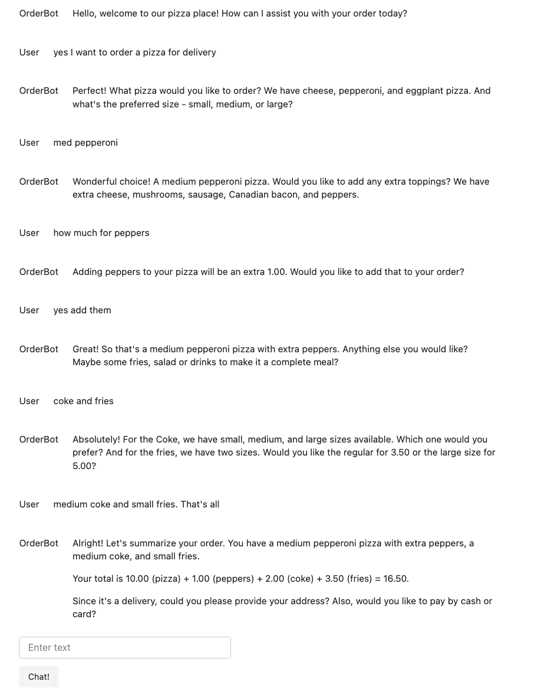

# Pizza-OrderBot

OrderBot is an interactive chatbot designed to assist customers in placing orders for a pizza restaurant. It guides users through the process of selecting items from the menu, customizing their orders, and providing a conversational and user-friendly experience. OrderBot utilizes a Large Language Model (LLM), specifically GPT-4, for generating natural language responses.

## Requirements

1. Make sure you have Python installed on your system (Python >= 3.6).

2. Install the required Python packages using pip:

   ```bash
   pip install openai python-dotenv panel
   ```

3. Create a `.env` file in the project directory.

4. Add your OpenAI API key to the `.env` file as follows:

   ```
   OPENAI_API_KEY="your_openai_api_key_here"
   ```

   Replace `"your_openai_api_key_here"` with your actual OpenAI API key.

5. Save the `.env` file.

6. In your Python script, import the necessary libraries and configure the OpenAI API client using the `dotenv` package:

   ```python
   import openai
   import os
   from dotenv import load_dotenv, find_dotenv

   # Load environment variables from .env file
   load_dotenv(find_dotenv())

   # Configure the OpenAI API client with your API key
   openai.api_key = os.getenv("OPENAI_API_KEY")
   ```

## Example Chat



## Credit
The code is inspired by [Youtube tutorial](https://youtu.be/kN_3CZ-iE1c?si=6zvoySMg1PKNRAow) by Isa Fulford and Andrew Ng. 

I made modifications:
- Updated the `get_completion_from_messages` function to use `openai.chat.completions.create`
- The conversation history now displays above the chat box, in the style of ChatGPT web interface.

